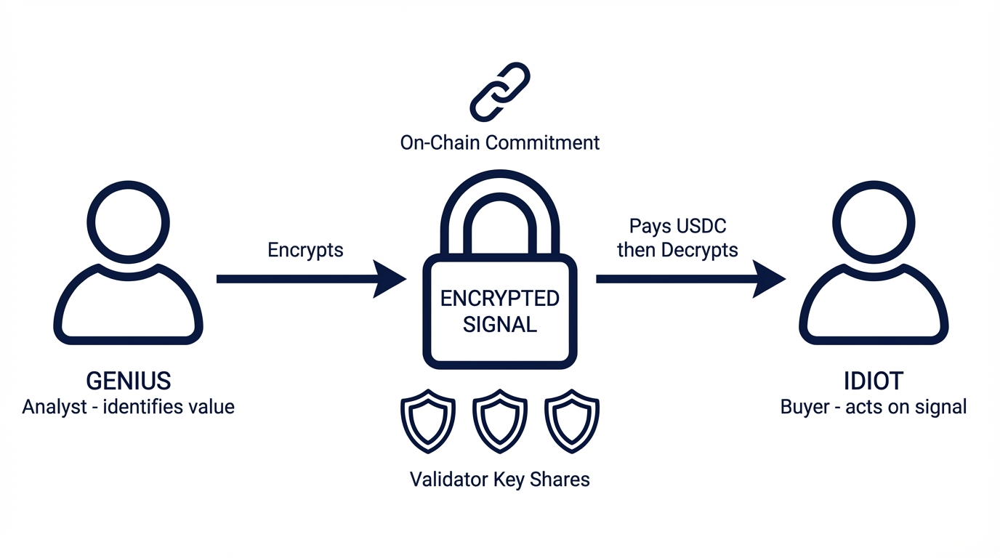
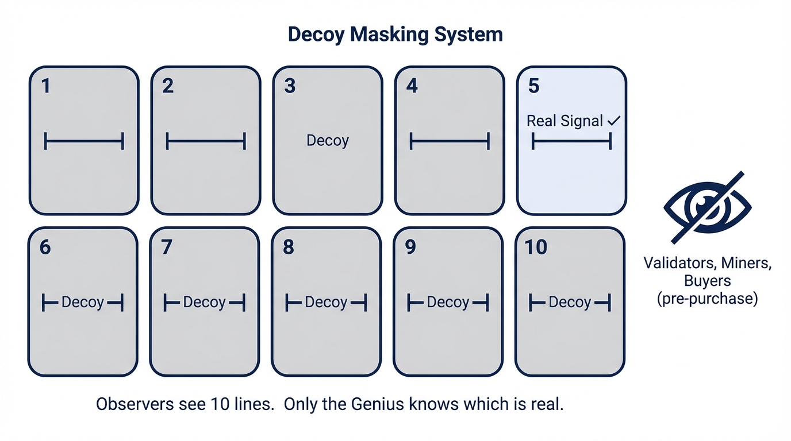
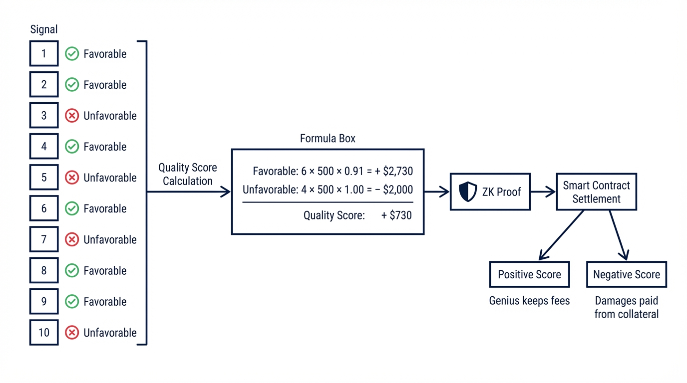
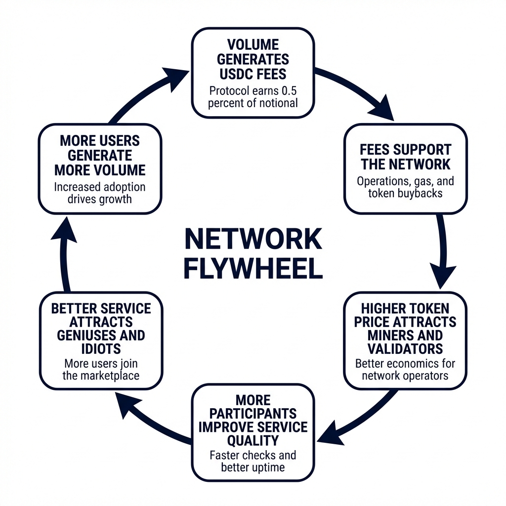
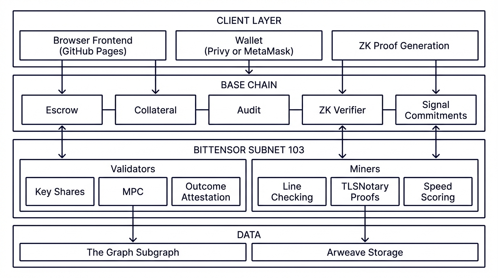

# Djinn Protocol: Whitepaper

### Intelligence × Execution

Buy intelligence you can trust. Sell analysis you can prove.
Signals stay secret forever — even from us.

Bittensor Subnet 103 · Base Chain · USDC

---

## Table of Contents

1. [The Problem](#1-the-problem)
2. [The Solution](#2-the-solution)
3. [The Accountability Layer](#3-the-accountability-layer)
4. [Key Terms](#4-key-terms)
5. [Life of a Signal](#5-life-of-a-signal)
6. [The Audit](#6-the-audit)
7. [Economics](#7-economics)
8. [Network Equilibrium](#8-network-equilibrium)
9. [Architecture](#9-architecture)
10. [Validators and Miners](#10-validators-and-miners)
11. [Security](#11-security)
12. [Dispute Resolution](#12-dispute-resolution)
13. [Legal Positioning](#13-legal-positioning)
14. [Edge Cases](#14-edge-cases)
15. [Web Attestation Service](#15-web-attestation-service)
16. [Beyond Sports](#16-beyond-sports)
17. [Governance](#17-governance)
- [Appendix A: API Reference](#appendix-a-api-reference)
- [Appendix B: Base Contracts](#appendix-b-base-contracts)
- [Appendix C: Cryptographic Details](#appendix-c-cryptographic-details)

---

## 1. The Problem

Skilled sports analysts face a binary choice: bet personally or sell picks.

**Betting limitations:** Sportsbooks restrict winning accounts. Markets have finite liquidity. Large positions move lines adversely. As a result, analytical edge cannot scale.

**Selling picks problems:** Track records lack accountability. Screenshots can be forged. Tweets disappear. Success correlates with marketing ability rather than analytical skill.

The fundamental issue is that information and execution are bundled together.

- **Information** = identifying value.
- **Execution** = placing bets.

These represent different capabilities. A brilliant analyst may lack bankroll discipline or sportsbook access. A skilled executor without a proprietary edge seeks quality analysis elsewhere.

---

## 2. The Solution

Djinn unbundles information from execution.

Analysts (**Geniuses**) sell predictions. Buyers (**Idiots**) purchase access. What buyers do with the information is their business: betting, not betting, or partial hedging. Djinn remains agnostic.

The separation benefits all parties:

- **Geniuses:** Edge scales across thousands of buyers without moving markets.
- **Idiots:** They are purchasing methodology, not execution risk.
- **Platform:** Information services have clearer regulatory standing than gambling.

### Two Core Guarantees

1. **Signals stay secret forever.** Not just until game time, but permanently. No entity, including Djinn, ever views signal content.

2. **Track records are verifiable forever.** Cryptographic proof confirms ROI and performance without revealing individual picks.



---

## 3. The Accountability Layer

Information markets typically lack accountability. Djinn implements four mechanisms:

### Cryptographic Timestamps

Every signal is committed on-chain before the game. It is encrypted so no one can see the content, but the commitment is provably locked in time. After contests conclude, records verify against public outcomes. Commitments are immutable.

### Collateral-Backed Guarantees

Geniuses deposit real money as collateral. After 10 signals with a given buyer, an audit occurs. Underperformance triggers damages paid from collateral, functioning as a standard service-level agreement.

### True Blindness

Signal creation involves:
- Client-side encryption
- Encryption key split via Shamir's Secret Sharing across validators
- Decoy lines that mask the actual signal
- Decryption only by purchasers, locally on their device

### Permanent Secrecy via Zero-Knowledge Proofs

For audits, neither party reveals signals to smart contracts. Instead, the client generates a zero-knowledge proof, a mathematical statement that says "I know the preimage of these on-chain commitments, and when I evaluate them against the public game outcomes, the Quality Score is X."

For public records, aggregate proofs work identically: "Across my 347 committed signals, my ROI is 8% and my favorable rate is 54%."

ZK circuits remain lightweight, involving only hash preimage openings, index checks, and arithmetic. Proof generation takes seconds on consumer hardware. On-chain verification costs fractions of a cent on Base and remains constant regardless of signal volume.

---

## 4. Key Terms

| Term | Definition |
|------|-----------|
| **Signal** | A specific prediction (Lakers −3 @ −110), including game, position, line, and odds |
| **Genius** | Posts signals, sets pricing, and deposits collateral |
| **Idiot** | Purchases signals and selects a notional amount |
| **Notional** | Reference amount selected by the buyer; determines both fees and potential audit damages |
| **Max Price (MP%)** | The Genius's fee as a percentage of notional |
| **SLA Multiplier** | Damages rate if methodology underperforms; minimum 100% |
| **Quality Score** | Audit metric; favorable outcomes minus SLA-weighted unfavorable outcomes |
| **Audit** | Settlement after 10 signals between a Genius-Idiot pair |
| **Odds** | Decimal format internally; −110 American = 1.91 decimal |
| **Zero-Knowledge Proof** | Cryptographic proof of a statement's truth without revealing underlying data |
| **TLSNotary Proof** | Cryptographic attestation of TLS-session data received from a web server |
| **Attestation** | A cryptographically verifiable record that information existed at a specific time |

---

## 5. Life of a Signal


### Creation

Genius Alice identifies value: Lakers −3 @ −110 (1.91 decimal). She accesses the Djinn dashboard showing estimated liquidity, current collateral ($50,000), and available exposure capacity.

She enters: NBA, Lakers vs Celtics Feb 15, Lakers −3 @ −110, 10% Max Price, 100% SLA Multiplier, expires 6:00 PM ET. She selects nine decoy lines to accompany her real signal.

MP%, SLA%, and expiry are set per signal. Alice can post her next signal with completely different parameters.

**System checks:**

1. **Executability:** Is this line available at 2+ sportsbooks at stated odds or better? The signal waits if the line is unavailable.
2. **Validator health:** Are 10 validators online and responsive? If the validator set is degraded, the client warns the user and waits for a healthy quorum.

If both checks pass, the browser:
- Encrypts the signal
- Splits the encryption key into 10 pieces via Shamir's Secret Sharing (7+ needed for reconstruction)
- Distributes shares to different Bittensor validators
- Commits the hash to the Base blockchain with 9 decoy lines
- Re-encrypts the signal key to Alice's wallet public key
- Posts an encrypted blob on-chain for wallet-based recovery

### Decoys

The Genius selects nine decoy lines to accompany the real signal (10 lines total). Decoy quality is the Genius's responsibility. Sophisticated Geniuses choose plausible decoys at similar odds across the same sport to maximize ambiguity:

| Index | Line | Real? |
|-------|------|-------|
| 1 | Lakers −5 @ +190 | |
| 2 | Celtics +3 @ −110 | |
| 3 | Lakers ML @ −220 | |
| 4 | Over 218.5 @ −110 | |
| 5 | Lakers −3 @ −110 | ✓ |
| 6 | Under 218.5 @ −110 | |
| 7 | Celtics +5 @ −135 | |
| 8 | Heat −2 @ −115 | |
| 9 | Warriors ML @ −180 | |
| 10 | Bucks −4.5 @ −120 | |

Observers see ten lines and a commitment hash. The real signal could be any of them.



### Discovery

Buyer Bob browses the Djinn marketplace, filtering by sport (NBA). He sees:

**Visible to Buyer:**
- Sport
- Genius wallet address
- Track record: ROI, favorable rate, unfavorable rate, void rate, signal count
- Track record by sport
- Purchase success rate (fraction of purchase attempts that were not voided for unavailability)
- Proof coverage percentage (fraction of finalized signals included in the verified track record; see [Track Record Integrity](#track-record-integrity))
- Max Price (10%)
- SLA Multiplier (100%)
- Signal expiry time

**Hidden (encrypted):**
- Game
- Teams
- Position
- Line
- Odds
- Sportsbook availability

Bob is buying methodology, not a specific pick.

Track records are displayed per sport. For example, Alice might show +18% ROI across 47 NBA signals but −15% across 3 NFL signals. Sport-level track records receive individual ZK proofs. Aggregate records across all sports are also available.

### Purchase

Bob clicks "Buy" with $1,000 notional and FanDuel as his sportsbook.

Notional is the amount of protection Bob is purchasing: the reference amount for both fees and potential SLA damages. It does not need to match any actual wager, and Bob does not need to place a bet at all. If Bob buys a signal at $1,000 notional but bets $2,000 at a sportsbook, SLA damages cover only $1,000. The excess exposure is Bob's risk.

Bob has previously deposited USDC into the Escrow contract, giving him a platform balance. This pre-funding enables instant purchases without wallet approval delays.

Behind the scenes:

1. The request goes to a validator, which checks whether the signal remains executable at FanDuel.
2. Validators run MPC: they query miners for available lines at Bob's sportsbook and compute whether the real line is available. The output is yes or no. Validators never learn which line is real.
3. If the signal is not executable, it is voided for Bob with no charge and remains available for other buyers.
4. If the signal is executable, the Escrow contract deducts $100 (10% MP × $1,000 notional) from Bob's balance, and validators release key shares.
5. Bob's browser collects 7+ shares, reconstructs the key, and decrypts locally. Bob sees: "Lakers −3 @ −110."
6. The browser re-encrypts the signal key to Bob's wallet public key and posts it on-chain for recovery from any device.

**Time:** 3–5 seconds. Pre-funded escrow eliminates wallet confirmation steps from the purchase flow.

### Two-Phase Miner Verification

**Phase 1 (immediate):** The miner receives 10 candidate lines, queries sportsbook APIs, and reports availability back to validators. This check gates the purchase, and speed is critical.

**Phase 2 (seconds later):** The miner generates a TLSNotary proof of the same TLS session from Phase 1. The proof is cryptographically tied to the sportsbook's server and cannot be forged without the server's private key. Validators verify the proof and update the miner's accuracy score, after which the proof is discarded. Phase 2 does not block the purchase and completes in seconds. If the proof contradicts the miner's Phase 1 report, the miner faces accuracy degradation and emission reduction.

### Outcome

The game occurs. Lakers win by 5. The position is covered: "favorable."

Validators attest the final score from official sources, requiring 2/3+ consensus. The outcome is written on-chain.

- If the Lakers won by 2: the signal is not covered, "unfavorable."
- If the Lakers won by exactly 3 or the game was cancelled: "void" (does not count toward the audit).

---

## 6. The Audit

After 10 signals between a Genius and an Idiot, an audit occurs.

### Why 10?

Ten signals provide meaningful statistical separation between skilled and random pickers:

| N | Random (50% WR) | Skilled (+15% edge) | Gap |
|---|-----------------|-------------------|-----|
| 1 | −0.05 | +0.12 | 0.17 |
| 5 | −0.11 | +0.27 | 0.38 |
| 10 | −0.15 | +0.38 | 0.53 |
| 20 | −0.21 | +0.54 | 0.75 |
| 50 | −0.34 | +0.85 | 1.19 |

At 10 signals, the gap of 0.53 is meaningful, roughly the difference between a losing strategy and the stock market's long-term risk-adjusted return. Ten signals balance statistical separation against the speed of accountability. An active Genius can complete a cycle in a week.

### Variance Is a Feature

Skilled Geniuses do not pass every audit. At −110 odds, a 5-5 split produces a negative Quality Score because the SLA penalty on unfavorable signals exceeds the favorable credit. A Genius needs 6+ favorable out of 10 to pass. A Genius with a genuine 60% win rate passes approximately 63% of the time, meaning that losing audits occur roughly once every three cycles due to variance alone.

The design is intentional. Short audit windows protect Idiots from extended exposure to a Genius who may have lost their edge. Skilled Geniuses recover quickly.

For fakers, the math is unforgiving. A random picker at 50% has only a 38% chance of passing any single audit. Consecutive passes collapse rapidly: 14% for two, 5% for three, and under 1% for five. After 10 consecutive audits, a faker has a 0.006% chance of passing all of them. A skilled Genius at 60% has about a 1% chance, which is 160 times more likely. Over time, the protocol reliably separates real skill from noise.

### Quality Score Calculation

For each signal:

- **Favorable:** +N × (odds − 1)
- **Unfavorable:** −N × SLA%

Where N = notional, odds = decimal odds, and SLA% = the Genius's SLA Multiplier.

The Quality Score is the sum across all 10 signals.

### Example

Alice has a 100% SLA Multiplier. Bob bought 10 signals at $500 notional each. Six were favorable and four were unfavorable, with average odds of 1.91 (−110 American):

- Favorable (6): 6 × $500 × 0.91 = **$2,730**
- Unfavorable (4): 4 × $500 × 1.00 = **−$2,000**
- Quality Score = **+$730**

The score is positive, meaning Alice's methodology delivered value. She keeps the fees.

If only 4 were favorable and 6 were unfavorable, the Quality Score would be −$1,180.



### Settlement via Zero-Knowledge Proof

When the 10th outcome finalizes, the client application generates a ZK proof of the Quality Score. The proof demonstrates correct computation from committed signals and public outcomes, without revealing any signal.

The smart contract verifies the proof and settles:

- **Tranche A (USDC):** Bob receives up to 100% of fees paid in actual USDC.
- **Tranche B (Credits):** Excess damages become non-transferable Djinn Credits.

Example: Bob paid $500 in fees (10 × $500 × 10%). The Quality Score is −$1,180. He receives:
- Tranche A: $500 USDC (all fees paid)
- Tranche B: $680 Credits

Bob never receives more USDC than he paid. Credits offset future purchases but cannot be cashed out. This is a standard service-level agreement structure.

### Track Record Integrity

A Genius's public track record must cover **every committed signal whose outcome has finalized**, not just signals from completed audit cycles. The requirement prevents cherry-picking.

The client application computes track record proofs automatically. When a Genius opens the app:
1. The client checks for newly finalized outcomes on-chain.
2. It recomputes aggregate statistics against all committed signals with that wallet.
3. It generates a ZK proof per sport and overall.
4. It submits the proof to the ZKVerifier contract on Base.

If a Genius has 100 committed signals but only proves 40, the track record displays "40 of 100 proven" and the gap is visible.

Track record staleness is informative. An active Genius with a good record updates frequently. A Genius who disappeared after a bad streak shows "Last verified: [date]" with declining proof coverage.

### Track Record Metrics

- ROI
- Favorable rate
- Unfavorable rate
- Void rate
- Signal count
- Purchase success rate
- Proof coverage

Each metric is computed per sport, with an aggregate also available. All metrics are backed by ZK proofs. Scoring rules are fixed at launch, but the Genius regenerates proofs each app session, enabling new metrics in future versions without disruption.

### Early Exit

Either party can exit before 10 signals. Settlement uses the current Quality Score but pays entirely in Credits, as the sample size is insufficient to justify USDC movement.

---

## 7. Economics

### Genius Pricing

- **Max Price (MP%):** The fee as a percentage of notional.
- **SLA Multiplier:** The damages rate applied if the signal is unfavorable. The minimum is 100%. A higher SLA multiplier signals confidence.

| Confidence Level | MP% | SLA% | Logic |
|------------------|-----|------|-------|
| Testing waters | 5% | 100% | Low fees, standard damages |
| Confident | 10% | 100% | Standard setup |
| Very confident | 10% | 150% | Higher damages signal confidence |
| Premium | 15% | 200% | High fees, willing to back it up |

### Collateral

Geniuses deposit USDC collateral covering worst-case damages across all active buyer relationships:

> Required collateral = Σ (notional × SLA%) across all active signals and all buyers.

Each buyer consumes collateral independently. If Alice posts a signal and three buyers each purchase at $1,000 notional with 100% SLA, Alice needs $3,000 in collateral for that signal alone. Her total collateral determines how much notional is available for buyers to purchase.

Excess collateral can be withdrawn at any time. If Alice has $50,000 deposited but only $30,000 is locked against active positions, she can withdraw $20,000 immediately.

If collateral drops below the minimum required, open signals auto-cancel. Existing audit cycles continue through to settlement.

### Protocol Fee

The protocol charges a fee of 0.5% of total notional at each audit. This fee is paid by the Genius and goes to Djinn Protocol. It covers all operational costs including Base chain gas fees for signal commitments, audit settlements, track record updates, and ZK verification. Users never pay gas directly. All protocol fees are denominated in USDC.

### Djinn Credits

Djinn Credits are non-transferable, non-cashable platform credits that work as a discount on future purchases.

Example: If a signal costs $100 and Bob has $30 in credits, he pays $70 USDC + $30 credits.

**Refund structure:**

| USDC In | Credits In | Refund | USDC Out | Credits Out |
|---------|-----------|--------|----------|------------|
| $100 | $0 | $40 | $40 | $0 |
| $70 | $30 | $40 | $40 | $0 |
| $70 | $30 | $90 | $70 | $20 |
| $0 | $100 | $40 | $0 | $40 |

A buyer can never extract more USDC than they put in.

Credits do not expire. They are non-transferable, non-cashable, and cannot be converted to USDC. They function solely as a discount on future purchases. This structure ensures that credits are not profits; they are a service credit analogous to store credit after a refund, carrying no cash value outside the platform.

---

## 8. Network Equilibrium

Djinn operates as Bittensor Subnet 103. The protocol generates real USDC revenue through a 0.5% fee on notional volume.

This revenue funds protocol development, smart contract maintenance, gas fees, ZK circuit updates, security reviews, documentation, and community support. A portion may also be used to purchase the subnet's alpha token, creating sustained demand that supports the token price.

### Revenue-Backed Token Value

Unlike subnets relying purely on speculative token value, Djinn's alpha token is backed by actual economic activity through protocol-funded buybacks. Miners and validators therefore earn emissions in a token whose value is supported by real, recurring revenue rather than inflation.

As platform volume grows, buyback pressure increases, supporting a higher token value and attracting more network participants.

### The Flywheel

1. Volume generates USDC fees.
2. Fees support the alpha token through buybacks.
3. A higher token price attracts more miners and validators.
4. More participants improve service quality: faster executability checks, more reliable outcome attestation, and better uptime.
5. Better service attracts more Geniuses and Idiots.
6. More users generate more volume.



### Self-Regulating Economics

Network participation is self-regulating. If the token price rises too high relative to revenue, excess miners enter and dilute returns until some exit. If the price drops, marginal miners leave, increasing returns for remaining participants until equilibrium is restored.

The protocol does not directly set miner or validator compensation. The market does.

Miner operating costs are modest: odds API subscriptions, TLSNotary proof generation, and basic cloud compute. Validator costs are similarly modest: outcome verification from public sources and standard server infrastructure. Low fixed costs mean that moderate platform volumes can support attractive returns.

### Emission Distribution

| Recipient | Share |
|-----------|-------|
| Miners | 41% |
| Validators | 41% |
| Subnet owner (Djinn) | 18% |

All user-facing transactions (escrow, collateral, fees, settlements, refunds) are denominated in USDC on Base. Users never need to hold or interact with TAO, the subnet alpha token, or any cryptocurrency other than USDC.

---

## 9. Architecture



### A Fully Decentralized Protocol

Once deployed, Djinn as a company operates no infrastructure. The protocol runs on publicly verifiable, decentralized systems at every layer.

| Component | Location | Why |
|-----------|----------|-----|
| Static frontend | GitHub Pages | Open source, publicly hosted, verifiable |
| Smart contracts | Base chain | Escrow, collateral, credits, audits, ZK verification |
| Signal commitments | Base chain | Immutable, timestamped, encrypted |
| Track records | Base chain | ZK-verified aggregate statistics |
| Data indexing | The Graph | Open-source subgraph, no Djinn servers |
| Encrypted key shares | Validators (Bittensor) | Shamir shares, distributed trust |
| MPC computation | Validators (Bittensor) | No single point of failure |
| Line verification | Miners (Bittensor) | Competitive, decentralized, TLSNotary-attested |
| Outcome attestation | Validators (Bittensor) | Consensus required |
| ZK proof generation | Client-side | Never leaves user's device |

### Code Verification

All client-side cryptographic operations (encryption, decryption, Shamir splitting, ZK proof generation, wallet interaction) run in the user's browser. The frontend is a static application served directly from a public Git repository via GitHub Pages or an equivalent verifiable platform.

Every deploy is a public commit. To change what users see, a commit must be made to the repository, visible to the entire world. The build process is reproducible: anyone can clone the repository, build it, and confirm the output matches the served version.

Djinn never serves code that handles user secrets. The client is open source, publicly hosted, and verifiable. The backend is the blockchain.

### User Experience

Users interact only with Base chain. They need only an ETH wallet and USDC. No TAO, no Bittensor wallet, no subnet knowledge, no ZK proof knowledge. All complexity is hidden.

### Wallet-Based Key Recovery

When a signal is created or purchased, the client re-encrypts the signal's decryption key to the user's wallet public key and stores the encrypted blob on-chain. Encrypted signals and outcomes are already stored on-chain permanently.

If a user loses their device, they can log in with their wallet (or via Privy social login to recover the wallet). The client pulls encrypted key blobs from the chain, decrypts each with the wallet's private key, and reconstructs the full history. Nothing is stored on Djinn's servers, and nothing is lost.

Local device storage serves as a performance cache, not a dependency. The wallet is the backup.

### Wallet Options

Djinn offers social login via Privy. The user clicks "Sign in with Google" and a wallet is created automatically. Users never see seed phrases. Djinn never sees emails, passwords, or private keys.

For larger amounts, users can export the key to MetaMask or use a self-custody wallet directly. The private key never leaves the wallet: the website requests decryption and the wallet handles it internally, similar to how Apple Pay works, where the merchant never sees the card number.

### Reading the Chain

Reading blockchain data is free. The client queries public metadata (signal status, sport, timestamps, outcomes) without decrypting. Decryption happens lazily, only when a user views a specific signal. With 10,000 signals, a metadata query takes seconds. Decrypting a single signal is instant.

A decentralized subgraph on The Graph indexes public on-chain data for fast queries. If the indexer is unavailable, the client falls back to reading the chain directly. Anyone can run their own indexer using the open-source subgraph definition.

---

## 10. Validators and Miners

### Validators

Validators are the trust layer. They:
- Hold encrypted key shares
- Coordinate MPC for executability checks
- Release shares after payment
- Attest game outcomes from official sources
- Aggregate outcome reports into consensus
- Score miners for emissions

The MPC protocol lets validators jointly compute "Is the real signal among the available lines?" without any validator learning which line is real. The output is a single bit, and the protocol requires 7 or more of the 10 validators.

### Validator Churn

Bittensor validators can rotate in and out. If a validator holding Shamir key shares goes offline between signal creation and purchase, those shares become unavailable. The protocol handles this simply: if fewer than 7 of the original 10 validators remain available at purchase time, the signal is voided and may be resubmitted.

The client mitigates this at creation time by checking validator health before distributing shares. If any validator in the selected set has degraded connectivity or recent downtime, the client selects a replacement. A background monitor flags signals whose share-holding validators are degrading, giving the Genius a chance to void and resubmit before a buyer encounters a failed purchase.

The vulnerable window is typically narrow: minutes to hours between creation and purchase. Catastrophic churn (4+ simultaneous departures) would indicate a broader network problem beyond the scope of any single signal.

### Outcome Attestation

Game outcomes are publicly verifiable facts: final scores from official league sources (NBA API, NFL API, ESPN, etc.). Validators independently query these sources and attest outcomes, requiring 2/3+ consensus before writing results on-chain. When official sources agree, which is almost always, validators converge trivially.

When validators disagree (ambiguous outcomes, stat corrections, suspended games), Bittensor's Yuma Consensus mechanism determines the canonical result. Validators whose attestations align with the consensus-weighted majority receive full credit; outliers are penalized. The result is a strong incentive to report accurately and wait for authoritative rulings before attesting, rather than racing to attest ambiguous results.

### Miners

Miners are line-checking oracles with cryptographic accountability. Their role is to verify real-time executability of betting lines against sportsbook data and prove they did so honestly.

During signal creation or purchase, miners receive 10 candidate lines (not knowing which is real), query sportsbook data sources to check availability at two or more sportsbooks, and report availability to validators. This is Phase 1: the fast check that gates the purchase.

Miners acquire their own data sources: paid odds APIs (e.g., The Odds API, OddsJam), direct sportsbook integrations, or their own scraping infrastructure. Data acquisition is the miner's responsibility and primary operational cost. Miners without reliable data sources produce inaccurate reports and lose emissions. As in any competitive market, the cost of participating is the cost of obtaining good data.

Seconds later, the miner submits a TLSNotary proof of the same TLS session (Phase 2). The proof is cryptographically tied to the sportsbook's server and cannot be forged without the sportsbook's private key. Validators verify the proof and update the miner's accuracy score, after which the proof is discarded. The accuracy score is a permanent record, but the proof itself is ephemeral: once the score is updated, the proof has served its purpose.

Because speed accounts for 40% of miner scoring, geographic proximity to sportsbook servers provides a measurable advantage. Miners optimizing for emissions will co-locate near major sportsbook infrastructure, typically in the eastern United States. That geographic concentration is a feature, not a bug: the fastest miners end up serving the regions where most sportsbooks operate, directly improving purchase latency for users.

### Miner Scoring

Miner emissions during active epochs depend on five metrics:

**During Active Epochs (signals being verified):**

| Metric | Weight | Who Competes |
|--------|--------|--------------|
| Speed | 40% | All miners |
| Accuracy | 20% | All miners (scored by TLSNotary ground truth) |
| Uptime | 10% | All miners |
| History | 10% | All miners |
| TLSNotary proof submission | 20% | Proof-submitting miners only |

**Speed** ranks miners by response latency. The fastest miner for a given query scores highest, normalized across all responding miners. Speed dominates because purchase latency is the primary user-facing quality metric: the 3–5 second purchase window is determined by miner response time.

**Accuracy** is binary per query: did the miner's Phase 1 report match the TLSNotary ground truth? It is accumulated as a rolling percentage. Its weight is lower than speed because the TLSNotary mechanism already punishes dishonesty directly through proof contradictions; this weight adds emission consequences on top.

**Uptime** is the percentage of epochs where the miner responded to health checks. It carries lower weight because it overlaps with speed: an offline miner cannot be fast.

**History** is consecutive epochs of participation, scaled logarithmically so that early loyalty is rewarded more than marginal gains at epoch 1,000. The curve prevents churn and rewards commitment.

**TLSNotary proof submission** is the percentage of queries where the miner submitted a valid TLSNotary proof. The pool is optional: miners who skip it forfeit 20% of potential emissions but face no penalty. Combined with accuracy, honest and verifiable reporting accounts for 40% of emissions.

**During Empty Epochs (no active signals):**

| Metric | Weight |
|--------|--------|
| Uptime | 50% |
| History | 50% |

Empty-epoch emissions keep miners online during low-volume periods and ensure that capacity is available when demand returns.

These are initial values. As the network matures and operational data accumulates, they can be adjusted through protocol governance.

### Continuous Accuracy Verification

The two-phase model transforms accuracy scoring from reactive to continuous. Proof-submitting miners create a ground truth benchmark for every executability query. If Miner A reports a line as available but Miners B, C, and D submit TLSNotary proofs showing it was not, Miner A's accuracy score drops automatically. No dispute process is needed.

The TLSNotary proof pool is optional. Miners who skip it forfeit 20% of potential emissions but face no penalty. Other miners' proofs can still expose inaccurate reporting. Game theory drives participation: if few miners submit proofs, the per-miner return from the 20% pool is high, attracting more submitters until the pool equilibrates.

The only rational strategies are to report honestly and submit proof (maximum earnings), or to report honestly and skip proof (lower earnings but no risk). Lying is always a losing strategy.

---

## 11. Security

**Miner collusion:** A majority of miners could falsely report line availability. However, the two-phase TLSNotary model means that honest miners automatically produce cryptographic evidence contradicting false reports. Colluding miners face accuracy score degradation and emission reduction without any formal dispute being needed. Such an attack requires controlling most miners and successfully contradicting verifiable cryptographic evidence from every honest miner.

**Validator collusion:** The protocol defends against validator collusion in layers. During honest protocol execution, the MPC reveals only a single bit (executable or not); no validator learns the secret index or the encryption key. Decoys add ambiguity against partial information leakage. Against active, out-of-band collusion by 7+ validators who pool their Shamir shares to reconstruct secrets, the defense is economic: colluding validators risk their staked TAO, and coordinating a supermajority of independently selected validators is operationally difficult. This is the standard trust model for any threshold cryptographic system.

**Genius front-running:** The Genius already knows their own signal, so this does not harm Idiots. Bad methodology results in SLA damages regardless.

**Sybil attacks on track records:** A Genius could create fake Idiot wallets and selectively complete favorable audit cycles. This is prevented by requiring track record proofs to cover all committed signals whose outcomes have finalized. A Genius cannot prove only 40 of 100 signals without the gap being visible. Cherry-picking is publicly detectable.

**Signal leakage:** Signals are encrypted client-side, split via Shamir, masked by decoys, and settled via ZK proofs. No entity, including Djinn, ever sees signal plaintext. Historical signals remain permanently encrypted on-chain, and track records are verified without revealing individual picks.

**Client code tampering:** The frontend is served from a public Git repository. Every deploy is a public commit, and the build is reproducible. Security researchers, competitors, and automated monitors can continuously verify that the served code matches the public source.

**Browser extension attacks:** A malicious browser extension with broad permissions could theoretically observe decrypted signal content in the DOM. The vulnerability is inherent to browser-based cryptography, not specific to Djinn. Mitigations include using a dedicated browser profile with extensions disabled, or using the protocol through a standalone application if one becomes available. The protocol's encryption, Shamir sharing, and ZK layers protect signals from every other attack vector. The browser itself is the last-mile trust boundary.

**TLSNotary and evolving TLS standards:** TLSNotary relies on the structure of TLS sessions to produce verifiable proofs. As TLS evolves (TLS 1.3 Encrypted Client Hello, post-quantum cipher suites), TLSNotary tooling must evolve alongside it. The protocol monitors TLSNotary compatibility with major sportsbook TLS configurations and will adapt proof mechanisms as the TLS landscape changes. If a specific sportsbook becomes incompatible with TLSNotary, miners cannot produce proofs for that sportsbook, and the accuracy scoring system reflects this naturally.

---

## 12. Dispute Resolution

### Outcome Disputes

Most outcomes are unambiguous: the Lakers won by 5, the final score is public, and validators agree. Occasionally, outcomes are contested. A game might be suspended in the 4th quarter due to weather, or a stat correction might change the final score after initial reporting. When validators fall below 2/3 consensus on an outcome, dispute resolution activates.

Example: A game is suspended with 2 minutes remaining and a 7-point lead. Some validators attest the leading team as winner based on the league's official ruling. Others mark the game as void because it was not completed in regulation. Consensus falls below 2/3.

Process:
1. Anyone challenges the current outcome by posting a stake ($100 USDC minimum).
2. Validators review the evidence and vote on the correct outcome.
3. If the challenge succeeds: the challenger gets their stake back plus a reward from slashed incorrect attesters.
4. If the challenge fails: the challenger loses their stake to the correct attesters.

All outcomes have a 48-hour finalization window before disputes close, allowing time for official league rulings to settle ambiguous situations.

### Executability Disputes

With universal two-phase TLSNotary verification, most executability disputes resolve automatically through continuous accuracy scoring. If a miner's Phase 1 report is contradicted by TLSNotary proofs from other miners, the inaccuracy is reflected in scores without manual intervention.

For cases where no miner submitted a TLSNotary proof for a specific query, a reactive dispute mechanism remains as a backstop. Any miner can stake collateral and present a TLSNotary proof after the fact. A single honest miner with a valid proof can overturn a colluding majority. Proofs must fall within the time window of the original executability query to prevent the use of stale data.

---

## 13. Legal Positioning

Djinn is an information marketplace, not a sportsbook, exchange, or gambling platform. The distinction is structural, not cosmetic.

### What Djinn Does

Djinn facilitates the sale of analytical predictions as an information service. Geniuses sell methodology, and Idiots purchase access. The transaction is a service-level agreement: pay for quality, receive a refund if quality is poor. It follows the same structure as a consulting engagement, research subscription, or investment newsletter.

### What Djinn Does Not Do

Djinn does not accept bets. It does not match bettors, set odds, or take a position on any sporting event. It does not know whether any user places a bet based on a signal. It does not facilitate, intermediate, or process any wager.

### Structural Enforcement

These are not policy commitments; they are architectural constraints enforced by protocol design:

**Djinn cannot see signals.** All signal content is encrypted client-side, and the encryption key is split across validators via Shamir's Secret Sharing. Djinn's servers never receive, process, or store signal plaintext. Anyone can verify this from the open-source client code.

**Djinn cannot see outcomes at signal level.** Audits are settled via ZK proofs. The smart contract verifies that the Quality Score was correctly computed without learning which signals were favorable or unfavorable. Djinn sees only the aggregate score.

**Djinn runs no infrastructure.** The frontend is served from a public repository. The indexer runs on a decentralized network. Smart contracts execute on Base. Validators and miners operate on Bittensor. Djinn writes code and deploys contracts; the protocol then runs itself.

**Djinn has no mechanism to connect a signal to a bet.** Even if Djinn wanted to determine whether a user bet on a signal, it could not. It does not have the data: signal content is encrypted, and users' sportsbook accounts are unknown to Djinn. There is no data path from "signal purchased" to "bet placed."

### Regulatory Context

Information services are regulated differently from gambling. Selling sports analysis is legal in every U.S. jurisdiction. The key regulatory question is whether Djinn's collateral and SLA structure constitutes a wager. It does not: the collateral is a performance bond backing a service guarantee, a standard mechanism in consulting, SaaS, and professional services. Damages for underperformance are capped at fees paid (USDC) plus service credits. An Idiot cannot profit from a Genius's poor performance.

The ZK proof layer further strengthens this position by ensuring that Djinn is structurally incapable of operating as a gambling intermediary. It is difficult to regulate an entity as a gambling platform when that entity provably cannot see the predictions being traded on its protocol.

---

## 14. Edge Cases

| Scenario | Resolution |
|----------|-----------|
| Game cancelled? | The signal is voided, does not count toward 10, and the fee is refunded. |
| Game postponed? | The signal is voided and refunded. It does not count. |
| Push? | The signal is voided. |
| Line moved before purchase? | The executability check fails, the signal is voided, and no fee is charged. |
| Line moved after purchase? | This does not matter. The outcome is based on whether the position covered. |
| Signal not available at buyer's sportsbook? | The purchase is voided for that buyer only, with no charge. The signal remains available for other buyers at different sportsbooks. |
| Genius runs out of collateral? | Open signals are cancelled. Existing audit cycles continue. |
| User loses device? | Wallet-based recovery applies. All signal keys are re-encrypted to the user's wallet public key on-chain. The user can log in from any device to restore their full history. |
| Genius goes offline? | The track record goes stale until they open the app, displaying "Last verified: [date]." No signals are lost. |
| Genius abandons mid-cycle? | Unproven signals accumulate on-chain and the track record coverage ratio declines visibly. Future buyers can see the gap, and the reputational damage serves as a deterrent. |
| Validators go offline before purchase? | The client monitors validator health. If fewer than 7 of the 10 share-holding validators remain, the signal is voided and may be resubmitted. The client warns the Genius proactively. |

---

## 15. Web Attestation Service

The TLSNotary infrastructure that Djinn builds for sports has immediate standalone value. A TLSNotary proof attests that a specific web server sent specific content at a specific time. It provides a decentralized, trustless, permanent record of what a website said: a cryptographic alternative to screenshots, web archives, and trust-based attestations.

### How It Works

A user submits a URL and fee to the Web Attestation contract on Base. The contract emits an event, and miners (the same miners online for sports executability checks) pick up the request, race to fetch the URL, and generate a TLSNotary proof of the server's response. Validators verify the proof and attest its validity on-chain.

The proof hash is stored on-chain permanently, while the full proof is stored on Arweave, a decentralized permanent storage network where data is paid for once and stored forever. Anyone can later retrieve the proof, verify it cryptographically, and confirm exactly what a given website displayed at a given time.

### Economics: Same Model as Sports

Web attestation follows the same economic model as sports. The attestation fee flows to the protocol as revenue, supporting the subnet's alpha token through the same buyback mechanism described in Section 8. Miners completing attestation work earn emission credit, scored on the same metrics as sports queries: speed, accuracy, and proof submission.

The approach is Bittensor-native. Emissions pay miners and validators for being online, responsive, and accurate. User fees flow into the protocol's revenue pool, supporting the alpha token, making emissions more valuable, and attracting better miners. The same flywheel applies whether a miner is checking a sportsbook line or attesting a web page.

From a miner's perspective, a web attestation request is indistinguishable from a sports executability check. Both involve fetching data from a server, generating a TLSNotary proof, and submitting it for validation. The scoring mechanism treats both workloads identically, which means attestation requests naturally fill low-volume sports periods, keeping miners engaged and the network responsive without requiring a separate incentive structure.

Bittensor's multiple incentive mechanism feature allows the subnet to allocate a portion of emissions specifically to web attestation work. The allocation ensures that miners are rewarded proportionally for both sports and attestation tasks without one crowding out the other.

### Use Cases

- **Legal evidence.** Prove that a website published specific content at a specific time. Useful for litigation, regulatory compliance, and intellectual property disputes.
- **Journalism.** Verify that a source published a statement before it was edited or deleted. Cryptographically stronger than screenshots or web archive snapshots.
- **Governance.** Prove that a DAO proposal, corporate announcement, or policy document was publicly available at a specific time.
- **Research.** Cite web sources with cryptographic proof of content and timestamp, creating reproducible references that cannot be retroactively altered.

### Relationship to Sports

Web attestation does not require Geniuses, Idiots, signals, encryption, decoys, or audits. It uses only the miner attestation layer: the same infrastructure, skills, and TLSNotary tooling. For miners, sports and web attestation are interchangeable workloads. For the network, web attestation generates additional protocol revenue during low-volume sports periods, strengthening the alpha token and improving miner retention.

Implementation requires a single additional smart contract on Base and a second incentive mechanism on the subnet, with no changes to the existing sports protocol.

---

## 16. Beyond Sports

Djinn's core mechanism is not specific to sports. It is a market for **accountable remote intelligence**: a protocol for someone who knows what to do to sell instructions to someone who can act but doesn't know what to do, with cryptographic proof at every layer.

The primitives are domain-agnostic:

- Enumerated available actions reported with cryptographic attestation
- Encrypted instructions committed before outcomes are known
- Objectively verifiable results (favorable, unfavorable, or void)
- SLA-based accountability over repeated interactions
- Track records that are verifiable without revealing underlying instructions

### What Changes Across Domains

Three things change when the protocol extends to a new domain:

**Available actions.** In sports, these are betting lines at sportsbooks. In other domains, they might be robot commands, trade orders, logistical routes, or any finite set of executable options.

**Attestation method.** In sports, miners use TLSNotary to prove sportsbook data. In other domains, attestation might come from signed sensor data, trusted execution environments, exchange settlement proofs, or any mechanism that cryptographically verifies what was available and what happened.

**Outcome verification.** In sports, outcomes are final scores from official sources. In other domains, they might be sensor readings, delivery confirmations, trade settlement records, or any objectively measurable result. All outcomes are reduced to favorable, unfavorable, or void.

### The Communication Delay Case

Some domains don't merely benefit from unbundling information and execution; they require it. Consider a robot on a factory floor, a drone in a remote location, or a rover on another planet. When communication delays make real-time remote control impossible, local executors must act on pre-committed instructions from remote intelligence. The executor reports available actions, transmits them to a remote analyst, receives instructions, and acts autonomously.

The interplanetary case makes this vivid. Light takes 3 to 24 minutes each way between Earth and Mars, so it is impossible to remotely control a Mars rover in real time. There must be local execution with remote intelligence. The rover reports available actions, Earth-based analysts select the optimal action, the rover executes, and the outcome is measurable. In this context, unbundling is not a design choice. It is physics.

In these environments, the accountability layer matters more, not less. The cost of bad instructions scales with the executing agent's value: a destroyed rover, not a lost bet. Verified track records of which intelligence sources produce good outcomes become critical infrastructure, not a convenience.

### Sequencing

The protocol launches with sports. The market exists today, outcomes are binary and objective, the action space is finite and publicly queryable, and the attestation infrastructure maps perfectly to TLSNotary. Every mechanism described in this paper has been designed for and tested against sports analytics.

Once the protocol is live and the mechanism is proven, expanding to new domains is a natural evolution. Each new domain introduces its own outcome verification and attestation mechanisms, running on the same core infrastructure: the same commitment scheme, ZK settlement, accountability layer, and economic flywheel.

The vision is a general-purpose marketplace for accountable intelligence. Sports is the proof of concept.

---

## 17. Governance

Protocol parameters (miner scoring weights, audit window size, fee percentages, emission allocations) are controlled by the subnet owner (Djinn Inc.). The arrangement is standard for Bittensor subnets: the subnet owner registers the subnet, deploys the incentive mechanism, and retains authority to update parameters as operational data dictates.

The approach is pragmatic, not ideological. Early-stage protocols require rapid iteration. Scoring weights that look correct on paper may need adjustment after observing real miner behavior. Fee structures may need rebalancing as volume scales. Decentralizing parameter control before the protocol has production data risks ossifying bad defaults.

Smart contracts on Base are immutable once deployed. Contract upgrades follow standard proxy patterns with timelock delays, giving users visibility into pending changes before they take effect.

As the protocol matures and operational data stabilizes, governance authority can progressively decentralize, either through on-chain governance mechanisms or delegation to the validator set. The timeline for this transition depends on protocol maturity, not a predetermined schedule.

---

## Appendix A: API Reference

### Validator API

**`POST /v1/signal`** — Genius deposits key share

```
Request:  { signal_id, encrypted_key_share, encrypted_index_share, signature }
Response: { received: true }
```

**`POST /v1/signal/{id}/purchase`** — Idiot purchases signal

```
Request:  { wallet, notional, sportsbook, signature }
Response (success): { executable: true, shares: [...], tx_hash }
Response (failed):  { executable: false, reason: "line_unavailable_at_sportsbook", voided: true }
```

**`POST /v1/analytics/attempt`** — Fire-and-forget to Djinn analytics

```
Body: { signal_id, result: "success" | "failed", validator, timestamp }
```

### Djinn API (via The Graph Subgraph)

**`GET /v1/signals`**

```
Query:    status=active, sport=NBA
Response: [{ id, genius, sport, mp_pct, sla_pct, expires_at,
             genius_roi, genius_favorable_rate, genius_unfavorable_rate,
             genius_void_rate, genius_signal_count, genius_purchase_success_rate,
             genius_proof_coverage }]
```

**`GET /v1/geniuses`**

```
Query:    sort=roi, sport=NBA
Response: [{ address, roi, favorable_rate, unfavorable_rate, void_rate,
             signal_count, proof_coverage, purchase_success_rate,
             active_signals, last_verified }]
```

**`GET /v1/accounts`** (authenticated)

```
Response: [{ genius, lifetime_signals, current_cycle, signals_until_audit }]
```

**`GET /v1/signals/history`** (authenticated)

```
Response: [{ id, genius, purchased_at, notional, outcome, content }]
```

**`GET /v1/credits`** (authenticated)

```
Response: { balance: 250.00 }
```

### Web Attestation API

**`POST /v1/attest`** — Submit attestation request

```
Request:  { url, callback_address, fee_usdc }
Response: { request_id, tx_hash, status: "pending" }
```

**`GET /v1/attest/{request_id}`** — Check attestation status

```
Response: { request_id, url, status, proof_hash, arweave_tx, attested_at, miner }
```

---

## Appendix B: Base Contracts

| Contract | Key Functions |
|----------|---------------|
| **SignalCommitment** | `commit(id, encrypted_blob, decoys[], hash)` |
| **Escrow** | `deposit()`, `purchase(signal_id, notional, sportsbook)`, `withdraw()` |
| **Collateral** | `deposit()`, `withdraw()`, `lock(signal_id)`, `release(signal_id)` |
| **CreditLedger** | `balanceOf(addr)` |
| **Account** | `status(genius, idiot)` → `{ cycle, count, quality_score }` |
| **Audit** | `trigger(genius, idiot)`, `verifyProof(zk_proof)`, `computeSettlement()` |
| **KeyRecovery** | `storeEncryptedKey(signal_id, encrypted_key, wallet)` |
| **ZKVerifier** | `verifyAuditProof(proof, public_inputs)`, `verifyTrackRecord(proof)` |
| **WebAttestation** | `request(url)`, `submitProof(request_id, proof_hash, arweave_tx)` |

### Purchase Flow

1. Idiot browser → Validator: `POST /v1/signal/{id}/purchase` with sportsbook
2. Validator → Miners: "Which lines are available at this sportsbook?"
3. Validators: `MPC(real_index ∈ available)` → bool
4. If false: void the signal for this buyer and return an error
5. If true: `Escrow.purchase(signal_id, notional, sportsbook)`
6. Validators → Idiot browser: key shares
7. Idiot browser: reconstruct → decrypt
8. Idiot browser: re-encrypt key to wallet public key → `KeyRecovery.storeEncryptedKey()`
9. Miners: submit TLSNotary proof → accuracy score updated

### Audit Flow

1. Account reaches 10 signals.
2. Client generates ZK proof of Quality Score from committed signals and public outcomes.
3. Anyone calls `Audit.trigger(genius, idiot)` with the ZK proof.
4. `ZKVerifier.verifyAuditProof()` confirms the proof against on-chain commitments.
5. If negative: Collateral → Escrow (Tranche A) + `CreditLedger.mint` (Tranche B).
6. If positive: Genius keeps fees.
7. Protocol fee: 0.5% of notional → Djinn.

### Track Record Update

1. Genius opens the app. Client decrypts all historical signals locally.
2. Client computes aggregate statistics (ROI, favorable rate, unfavorable rate, void rate) against all committed signals with finalized public outcomes.
3. Client generates a ZK proof of aggregate statistics, per sport and overall.
4. Proof is submitted on-chain via `ZKVerifier.verifyTrackRecord()`.
5. Public track record updates with aggregate stats and proof coverage ratio. No individual signal is revealed.

### Web Attestation Flow

1. User submits URL and fee to `WebAttestation.request()`.
2. Contract emits `AttestationRequested` event.
3. Miners fetch the URL and generate a TLSNotary proof.
4. First valid proof is submitted via `WebAttestation.submitProof()`.
5. Contract verifies proof validity, records the attestation, and stores the proof hash on-chain.
6. Full proof is uploaded to Arweave for permanent retrieval.

---

## Appendix C: Cryptographic Details

### Signal Encryption

Signals are encrypted client-side using AES-256-GCM with a randomly generated symmetric key. The key is then split via Shamir's Secret Sharing over a prime field (256-bit prime), producing 10 shares with a reconstruction threshold of 7.

Each share is individually encrypted to its assigned validator's public key before transmission. The original symmetric key is also re-encrypted to the Genius's wallet public key and stored on-chain for wallet-based recovery.

### Multi-Party Computation for Executability

The MPC protocol enables validators to jointly determine whether the real signal is among the lines reported as available by miners, without any validator learning which line is real.

The protocol operates as follows:

1. Each validator holds one Shamir share of the real signal's index (an integer 1–10).
2. Miners report a set of available line indices (e.g., {1, 3, 5, 7, 9}).
3. Validators execute a secure comparison: they jointly compute whether the secret index is a member of the available set, using additive secret sharing over a finite field.
4. The computation requires two communication rounds among the 7+ participating validators.
5. The output is a single bit: available or not. No validator learns the secret index.

The MPC is lightweight because the computation is simple (set membership of a single integer). It is not general-purpose MPC but a narrow, optimized protocol for this specific operation, keeping latency within the 3–5 second purchase window.

### Zero-Knowledge Proofs

Audit and track record proofs use a SNARK-based proving system (candidate: Groth16 over BN254 or PLONK, with final selection based on proving time benchmarks on consumer hardware).

The ZK circuit for audit settlement performs:
1. Hash preimage opening: proves knowledge of signal content matching on-chain commitment hashes.
2. Index verification: proves each signal's real index falls within 1–10.
3. Outcome evaluation: computes favorable/unfavorable/void for each signal against public on-chain outcomes.
4. Quality Score arithmetic: sums the weighted outcomes per the published formula.

Circuit size is O(n) in the number of signals (10 for audits, up to hundreds for track records). Proof generation targets under 10 seconds on consumer hardware. On-chain verification is constant-time regardless of signal count.

Track record proofs follow the same circuit structure but cover all committed signals with finalized outcomes, not just the current audit window.

### TLSNotary

TLSNotary produces a cryptographic proof that a TLS session between a miner and a sportsbook server contained specific data. The proof is bound to the sportsbook's TLS certificate, making it unforgeable without the sportsbook's private key.

The protocol currently targets TLS 1.2 and TLS 1.3 sessions. As TLS standards evolve, proof generation tooling must track compatibility. The two-phase miner model isolates this risk: Phase 1 (fast response) does not depend on proof generation succeeding, so TLSNotary compatibility issues affect miner scoring but never block user purchases.

---

> Djinn unbundles information from execution.
>
> The protocol runs itself.

**Bittensor Subnet 103 · Base Chain · USDC**

[djinn.gg](https://djinn.gg)
